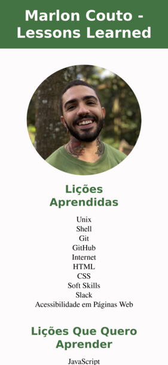
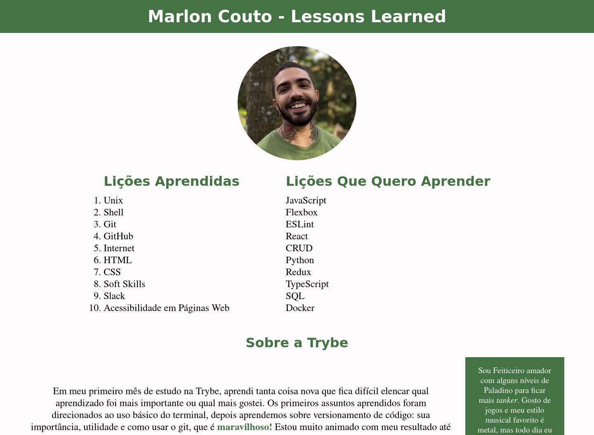

# Lessons Learned

Foi meu primeiro projeto feito na Trybe, ainda durante o módulo de Fundamentos.
Eu obtive 100% de aprovação nos requisitos obrigatórios e bônus desse projeto.

## Sumário

- [Geral](#geral)
  - [Proposta](#proposta)
  - [Screenshot](#screenshot)
  - [Links](#links)
- [Processo](#processo)
  - [Stack](#stack)
  - [Aprendizados](#aprendizados)
  - [Desenvolvimento](#desenvolvimento)
  - [Recursos](#recursos)
- [Autor](#autor)
- [Agradecimentos](#agradecimentos)

## Geral

### Proposta

A proposta desse projeto é desenvolver um site que contenha uma série de informações sobre o que eu aprendi na Trybe até o momento. O site deverá estar com elementos posicionados e estilizados e deverá conter semântica apropriada para que seja acessível e melhor ranqueado.

- Nesse projeto o StyleLint foi utilizado para avaliar a qualidade e legibilidade do código CSS
- Os requisitos do projeto foram avaliados pelo Cypress
- Requisitos:
  1. A cor de fundo da página deve ser rgb(253, 251, 251)
  2. Adicione uma barra superior com um título
  3. Adicione uma sua foto à página
  4. Adicione uma lista de lições aprendidas à página
  5. Crie uma lista de lições que ainda deseja aprender para a página
  6. Adicione um rodapé para a página
  7. Insira pelo menos um link externo na página
  8. Crie um artigo sobre seu aprendizado
  9. Crie uma tag html aside que contenha uma breve descrição sobre você
  10. Aplique elementos HTML de acordo com o sentido e propósito de cada um deles. A sua página deve conter os seguintes elementos: article, header, aside e footer
  11. Teste a semântica da sua página usando o site CodeSniffer
  12. Adicione uma tabela à página
  13. Utilize o Box model. Altere margin, padding e border de algum elemento na página
  14. Altere atributos relacionados às fontes
  15. Posicione a tag article e a tag aside uma ao lado do outra

### Screenshot

#### Mobile View



#### Desktop View



### Links

- Live Site URL: [Lessons Learned](https://lessons-learned-beta.vercel.app/)

## Processo

### Stack

- HTML5 Semântico
- Propriedades customizadas do CSS3
- Flexbox
- Layout mobile-first

### Aprendizados

Ao realizar esse projeto eu aprendi como estilizar um documento HTML usando CSS e sobre o uso de tags semânticas para melhorar a acessibilidade e ranqueamento de um site.

Exemplo:

```html
  <a href="https://www.betrybe.com/" target="_blank" title="Abrir o site da Trybe">Trybe</a>
```

No código acima, adicionei o atributo ```title``` para explicitar a ação que o link realiza ao ser clicado.

### Desenvolvimento

Quero continuar aprendendo x e preciso melhorar y.

### Recursos

- [Exemplo](https://www.exemplo.com) - Esse exemplo me ajudou a entender como fazer isso e aquilo.

## Autor

- Portfólio - [Nome](https://www.portfolio.com)
- LinkedIn - [username](https://https://www.linkedin.com/in/username)
- Twitter - [@username](https://www.twitter.com/username)

## Agradecimentos

Agradeço a Fulano de Tal pela ajuda. O projeto de Ciclano de Tal me serviu de inspiração para esse projeto.
